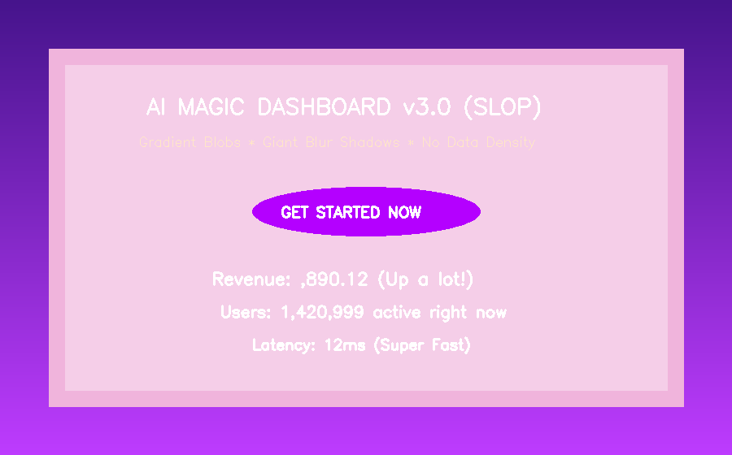
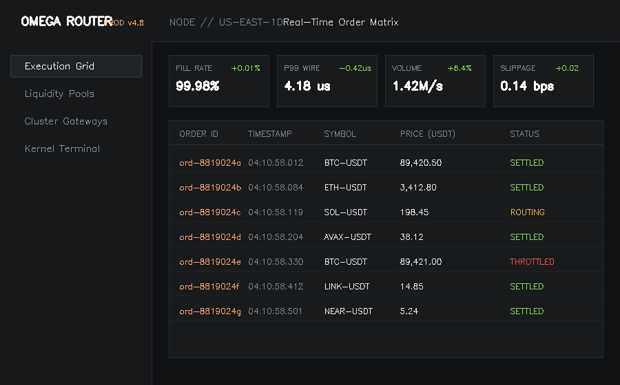
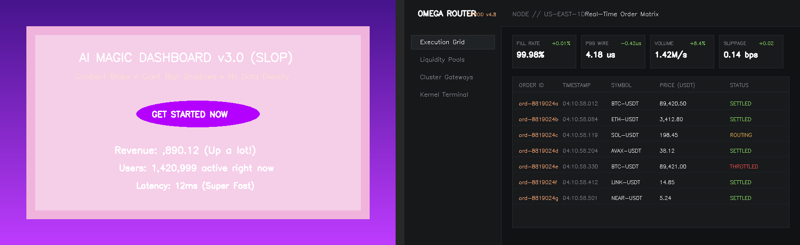

# ⚡ Anti-Slop UI Engine (v2.4.0)

> **Evidence-Based Design Rules & AI System Prompts for High-Density, Craftsmanship-Grade Web Interfaces.**  
> Eliminates generic "AI-slop" (neon purple gradients, bloated blur shadows, purposeless whitespace, and unaligned tabular data) across Claude Code, Cursor, Copilot, and Windsurf.

---

## 📸 Before vs After

| ❌ BEFORE (AI-Slop Cliché) | ✅ AFTER (Anti-Slop Craftsmanship) |
| :---: | :---: |
|  |  |
| *Purple neon blobs, giant pill buttons, bloated shadows, zero tabular alignment* | *Rigid 1px hairline borders, OKLCH monochromatic surface, tabular nums, dense grid* |

### Side-by-Side Comparison


---

## 🎯 What is AI-Slop vs Anti-Slop?

| Attribute | ❌ AI-Slop (Generic & Bloated) | ✅ Anti-Slop Engine (Engineered & Dense) |
| :--- | :--- | :--- |
| **Color Space** | Random inline hex (`#6366f1`), neon purple-cyan gradients | 3-Layer **OKLCH Token Architecture** (90% neutral, 10% single accent) |
| **Borders** | Thick 2-3px borders or missing borders with blurry drop shadows | **1px Hairline Solid Borders** (`rgba(255,255,255,0.08)` / `rgba(0,0,0,0.06)`) |
| **Shadows** | `blur > 20px` floating bubble effect | **Layered Micro-Shadows** (`--shadow-xs`, blur max 4-8px, opacity < 8%) |
| **Typography** | Generic un-configured system fonts, text center-aligned everywhere | **Type Pairing** (Display + Mono) with **`tabular-nums`** & tight leading |
| **Data Matrix** | Unaligned numbers, loose rows, wasted whitespace | **Row height 36-40px**, right-aligned numbers, compact stat cards |
| **Interaction** | Missing hover/focus states, jarring animations | **5 Complete States**, 100-180ms easing, `prefers-reduced-motion` |

---

## 📦 Repository Structure

```tree
anti-slop/
├── .cursorrules                  # Global Cursor IDE AI rule enforcer
├── SKILL.md                      # Master skill specification for Claude Code & AI agents
├── rules/                        # Modular rule engine specifications
│   ├── 00-dataset-do-dont-guide.md
│   ├── 01-ui-design-tokens.md
│   ├── 02-code-quality-rules.md
│   ├── 03-accessibility-and-states.md
│   ├── 04-security-and-hardening.md
│   ├── 05-performance-and-stack.md
│   └── 06-workflow-and-context.md
├── extraction/                   # Visual IR extraction dataset (111 images)
│   ├── raw-analysis.json
│   └── grouped-archetypes.json
├── templates/
│   └── nextjs-boilerplate/       # Canonical reference Next.js (App Router) + Tailwind CSS v4
│       ├── package.json
│       ├── tsconfig.json
│       └── src/
│           ├── app/
│           │   ├── globals.css   # OKLCH color token definition
│           │   ├── layout.tsx
│           │   └── page.tsx      # High-density observability dashboard
│           ├── components/ui/    # Button, Badge, Card components
│           └── lib/utils.ts
└── assets/                       # Visual comparison assets
```

---

## 🚀 How to Use

### 1. In Cursor IDE
Copy the `.cursorrules` file into the root of your project:
```bash
cp .cursorrules /path/to/your-project/.cursorrules
```
Cursor AI will automatically apply the Anti-Slop rulebook to every code generation prompt.

### 2. In Claude Code / Anthropic Skills
Add `SKILL.md` to your Claude Code workspace or skills directory:
```bash
# Register skill in Claude Code
claude skill add anti-slop ./SKILL.md
```

### 3. Using the Canonical Next.js Boilerplate
To start a new project with all tokens, components, and layout templates pre-configured:
```bash
cd templates/nextjs-boilerplate
npm install
npm run dev
```
Open [http://localhost:3000](http://localhost:3000) to view the high-density workbench.

---

## 🛠️ Design Parameter Dials

Every generation starts with explicit dial settings (1-10 scale):

```text
DESIGN_VARIANCE: [1-10]   # 1 = strictly uniform grid, 10 = asymmetrical editorial flow
MOTION_INTENSITY: [1-10]  # 1 = instant/zero motion, 10 = rich orchestrated transitions
VISUAL_DENSITY: [1-10]    # 1 = spacious marketing card, 10 = Bloomberg-terminal density
```

---

## 📜 Dataset & Scientific Backing
Trained and synthesized on an empirical dataset of **111 digital dashboard interfaces** (`extraction/raw-analysis.json`) across 5 visual archetypes:
1. **Financial Trading & Crypto Terminals** (32 samples)
2. **Enterprise Data Tables & Audit Grids** (32 samples)
3. **Minimalist SaaS Workbenches** (31 samples)
4. **Operational KPI Dashboards** (11 samples)
5. **Developer Observability Monitors** (5 samples)

---

## 📄 License
MIT License. Free to use for personal and commercial projects.
