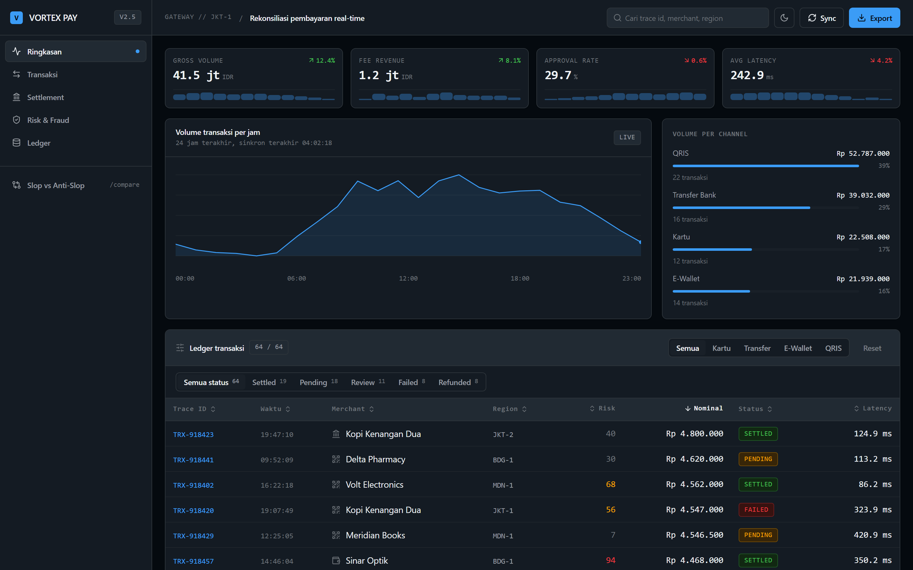
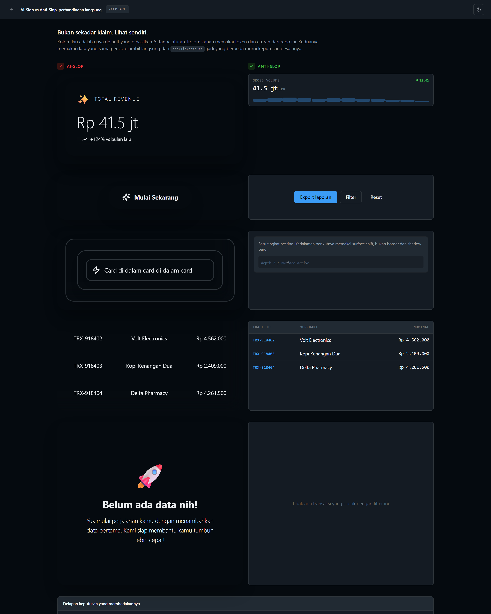
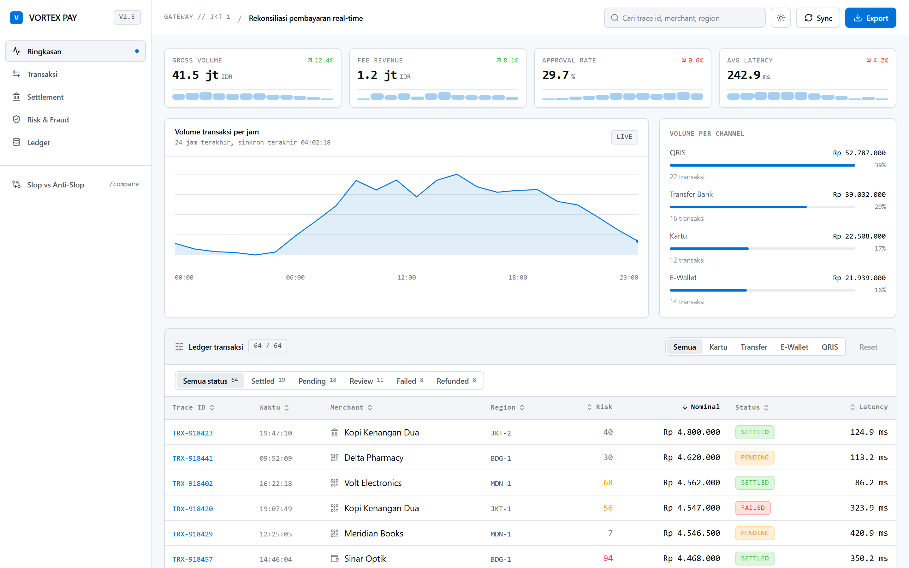
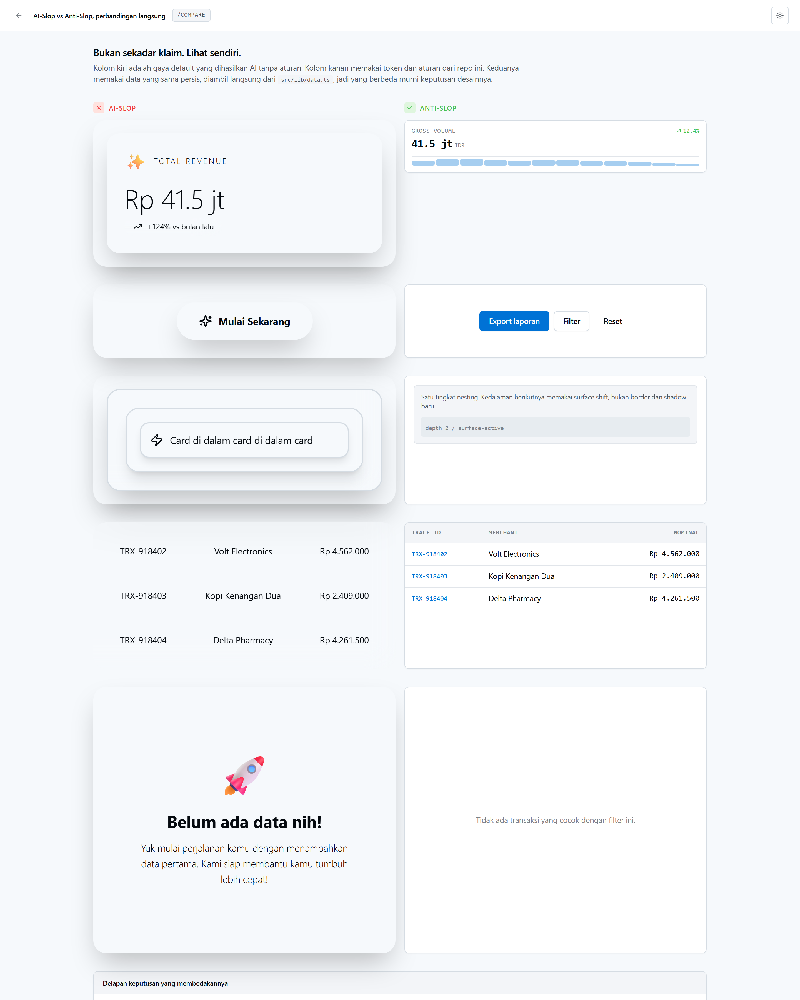

# Anti-Slop UI Engine

Aturan desain dan prompt sistem untuk agen AI (Claude Code, Cursor, Copilot, Windsurf) yang menolak gaya default hasil generate AI: gradient ungu, radius 24px di semua elemen, shadow blur tebal, whitespace tanpa fungsi, dan tabel yang angkanya tidak sejajar.

Sumbernya bukan opini. Aturan ini disintesis dari data yang sudah diuji coba untuk dipelajari, lalu diuji dengan linter, validator, dan satu halaman perbandingan yang bisa dibuka sendiri.

---

## Lihat perbedaannya

Dua halaman ini memakai dataset yang sama persis (`src/lib/data.ts`). Yang berbeda hanya keputusan desainnya.

| Dashboard kanonik (`/`) | Perbandingan langsung (`/compare`) |
| :---: | :---: |
|  |  |
|  |  |

---

## Tujuh keputusan yang membedakannya

| Aspek | Slop default AI | Standar repo ini | Aturan |
| :--- | :--- | :--- | :--- |
| **Warna** | Gradient ungu-cyan, hex inline (`#6366F1`) | OKLCH 3 lapis, 90% netral + satu accent | `rules/01` §3 |
| **Radius** | 24px di semua elemen, pill di container | 4px badge, 6px kontrol, 8-12px card | `rules/01` §1 |
| **Shadow** | blur 40px, glow berwarna | `--shadow-xs`, blur 2px, opacity 4% | `rules/01` §4 |
| **Border** | 2-3px pekat, atau tanpa border | hairline 1px `rgba(255,255,255,0.08)` | `rules/01` §4 |
| **Nesting** | card di dalam card di dalam card | maksimum 1 level, sisanya surface shift | `rules/01` §1 |
| **Angka** | proporsional, rata kiri, tidak sejajar | `tabular-nums`, rata kanan, lebar kolom tetap | `rules/01` §5 |
| **Kepadatan** | `py-6 px-8`, satu baris per layar | baris 40px, `px-3`, 12 baris per layar | `rules/01` §2 |

Keduanya bisa dilihat berdampingan di `/compare`. Materi versi slop ada di `src/components/slop-reference.tsx`, sengaja melanggar semua aturan, dan dikecualikan dari kedua linter.

---

## Struktur repo

```tree
anti-slop/
├── .cursorrules                  # Rule enforcer untuk Cursor IDE
├── SKILL.md                      # Spesifikasi skill untuk Claude Code & agen AI
├── rules/                        # Spesifikasi aturan modular
│   ├── 00-dataset-do-dont-guide.md
│   ├── 01-ui-design-tokens.md
│   ├── 02-code-quality-rules.md
│   ├── 03-accessibility-and-states.md
│   ├── 04-security-and-hardening.md
│   ├── 05-performance-and-stack.md
│   └── 06-workflow-and-context.md
├── extraction/                   # Dataset IR yang sudah diuji coba untuk dipelajari
│   ├── raw-analysis.json
│   └── grouped-archetypes.json
├── templates/nextjs-boilerplate/ # Implementasi kanonik: Next.js App Router + Tailwind v4
│   ├── src/app/
│   │   ├── globals.css           # Sumber token kanonik (OKLCH 3 lapis)
│   │   ├── layout.tsx
│   │   ├── page.tsx              # Dashboard rekonsiliasi pembayaran
│   │   └── compare/page.tsx      # Slop vs anti-slop, data identik
│   ├── src/components/ui/        # button, badge, card, input, metric-card,
│   │                             # data-table, area-chart, sparkline,
│   │                             # segmented-control, stat-breakdown, theme-toggle
│   ├── src/components/slop-reference.tsx  # Materi pembanding, jangan dipakai di produksi
│   ├── src/lib/data.ts           # Dataset deterministik (seeded PRNG)
│   └── scripts/capture-screenshots.mjs    # Screenshot README via Playwright
├── scripts/
│   ├── check-slop.mjs            # Linter Node (audit src/ + templates/)
│   └── validate_dataset.py       # Validator dataset + token OKLCH (Python 3.10+)
└── assets/                       # Screenshot hasil capture
```

Satu kosakata token. Nama token didefinisikan sekali di `templates/nextjs-boilerplate/src/app/globals.css`. `SKILL.md` dan `rules/01-ui-design-tokens.md` adalah spesifikasi naratif yang merujuk ke sana, bukan definisi paralel. Tidak ada `src/` di root repo.

---

## Cara pakai

**Cursor IDE.** Salin `.cursorrules` ke root project kamu:

```bash
cp .cursorrules /path/to/your-project/.cursorrules
```

**Claude Code.** Pasang `SKILL.md` ke direktori skills.

**Clone boilerplate.** Jalankan dashboard dan halaman perbandingannya:

```bash
cd templates/nextjs-boilerplate
npm install
npm run dev
```

- `http://localhost:3000` untuk dashboard kanonik
- `http://localhost:3000/compare` untuk perbandingan slop vs anti-slop

**Jalankan auditnya sendiri** dari root repo:

```bash
node scripts/check-slop.mjs        # linter Node
python scripts/validate_dataset.py # validator dataset + token
```

`check-slop.mjs` memindai `src/`, `components/`, `app/`, dan `templates/` terhadap larangan gradient ungu-indigo, radius >= 16px, shadow `xl`/`2xl`, hex inline, `backdrop-blur` tanpa alasan, `h-screen`, em-dash, dan CSS variable yang ditulis mentah sebagai utility Tailwind. Keluar dengan kode 1 kalau ada pelanggaran, jadi bisa dipasang di CI.

**Perbarui screenshot README** setelah mengubah UI:

```bash
cd templates/nextjs-boilerplate
npm run build && npx next start -p 3111
node scripts/capture-screenshots.mjs http://localhost:3111   # butuh playwright
```

---

## Tiga dial parameter

Setiap generasi dimulai dengan tiga angka skala 1-10:

```text
DESIGN_VARIANCE: [1-10]   # 1 = grid seragam ketat, 10 = aliran editorial asimetris
MOTION_INTENSITY: [1-10]  # 1 = tanpa motion, 10 = transisi terorkestrasi
VISUAL_DENSITY: [1-10]    # 1 = card marketing lapang, 10 = kepadatan terminal trading
```

Baseline default: `8 | 6 | 4`.

---

## Dataset

Aturan disintesis dari data operasional dan antarmuka yang sudah diuji coba untuk dipelajari, mencakup arketipe seperti Financial Trading & Crypto Terminals, Enterprise Data Tables & Audit Grids, Minimalist SaaS Workbenches, Operational KPI Dashboards, dan Developer Observability Monitors. Detailnya ada di `extraction/` untuk yang ingin menelusuri lebih lanjut.

---

## Lisensi

MIT. Bebas dipakai untuk project pribadi maupun komersial.
